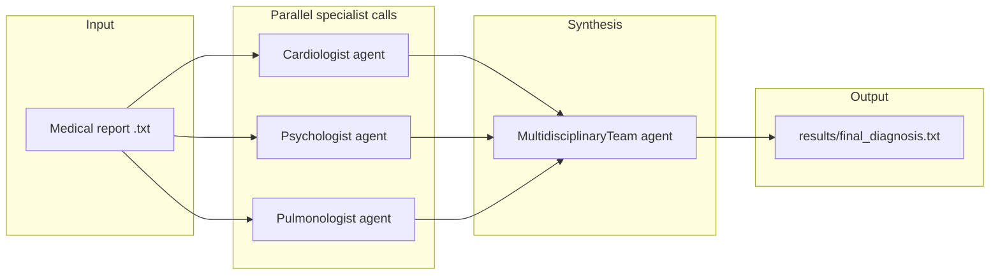

# In-depth code explanation

This document walks through every part of the runnable Python code in this repository: how data flows from a text medical report through parallel LLM calls to a final combined output file. It also calls out design choices, dependencies, and a few implementation details worth knowing if you extend the project.

---

## What this project does (one paragraph)

The program reads a **single patient narrative** from a `.txt` file under `Medical Reports/`. It instantiates three “specialist” agents—**Cardiologist**, **Psychologist**, and **Pulmonologist**—each backed by the same underlying LLM client (`ChatOpenAI`) but with **different system-style prompts**. Those three agents are executed **concurrently** using a thread pool. Their textual outputs are then passed into a fourth agent, **MultidisciplinaryTeam**, whose prompt asks the model to synthesize **three possible health issues** with reasons. Finally, the program writes the synthesized text to `results/final_diagnosis.txt`.

This is a **demonstration / educational** pattern for “multi-agent” orchestration. It does not perform deterministic medical reasoning; it produces **model-generated text** conditioned on prompts and the input report.

---

## Repository layout (code-relevant)

| Path | Role |
|------|------|
| `Main.py` | Entry point: load env, read report, run agents, save output |
| `Utils/Agents.py` | Agent class hierarchy, prompts, LLM invocation |
| `Medical Reports/*.txt` | Sample patient reports (plain text) |
| `apikey.env` | Local secrets file; loaded by `python-dotenv` (must not be committed) |
| `requirements.txt` | Python dependencies |

---

## Dependencies and runtime environment

### `requirements.txt` (what the code relies on)

The agents module imports:

- **`langchain_core.prompts.PromptTemplate`** — wraps a string template and handles `.format(...)` substitution for variables embedded as `{variable_name}`.
- **`langchain_openai.ChatOpenAI`** — LangChain chat model class that talks to OpenAI’s Chat Completions–style API using standard LangChain message abstractions.

Other packages listed in `requirements.txt` may be intended for future work (for example `langchain_ollama`, `reportlab`); **the current `Main.py` + `Agents.py` path only requires the LangChain OpenAI stack and `python-dotenv`** for configuration loading.

### Configuration: `OPENAI_API_KEY`

`Main.py` calls:

```python
load_dotenv(dotenv_path='apikey.env')
```

That loads key/value pairs from `apikey.env` into process environment variables. `ChatOpenAI` (by convention) reads **`OPENAI_API_KEY`** from the environment (unless you pass a key explicitly, which this code does not).

**Security note:** Treat `apikey.env` like a password file. It should stay local and out of git history.

---

## High-level architecture



**Why parallelize?** The three specialist calls are independent: each only needs the original `medical_report` string. Running them concurrently can reduce end-to-end latency when network/API time dominates.

---

## `Main.py` — detailed walkthrough

### Imports

```python
from dotenv import load_dotenv
from concurrent.futures import ThreadPoolExecutor, as_completed
from Utils.Agents import Cardiologist, Psychologist, Pulmonologist, MultidisciplinaryTeam
import json, os
```

- **`load_dotenv`**: loads environment variables from `apikey.env`.
- **`ThreadPoolExecutor` / `as_completed`**: runs blocking LLM calls in parallel threads.
- **Agent classes**: thin subclasses defined in `Utils/Agents.py`.
- **`os`**: used to create the output directory.
- **`json`**: imported but **not used** in the current file (harmless, but could be removed in a cleanup).

`load_dotenv` is also duplicated twice in the file; only one import is needed.

### Load secrets

```python
load_dotenv(dotenv_path='apikey.env')
```

This path is **relative to the current working directory** when you run `python Main.py`. If you run the script from another folder without adjusting paths, this may fail to find the file.

### Read the medical report

```python
with open("Medical Reports\Medical Rerort - Michael Johnson - Panic Attack Disorder.txt", "r") as file:
    medical_report = file.read()
```

- Reads the entire file into a single Python string `medical_report`.
- The path uses **Windows-style backslashes**. That works on Windows; on macOS/Linux you would typically use forward slashes or `pathlib` for portability.

### Construct the specialist agents

```python
agents = {
    "Cardiologist": Cardiologist(medical_report),
    "Psychologist": Psychologist(medical_report),
    "Pulmonologist": Pulmonologist(medical_report)
}
```

Each value is an object inheriting from `Agent` (see next section). Each specialist receives the **same** `medical_report` string; differentiation is entirely via **prompt text** inside `Agents.py`.

### Concurrent execution pattern

```python
def get_response(agent_name, agent):
    response = agent.run()
    return agent_name, response

responses = {}
with ThreadPoolExecutor() as executor:
    futures = {executor.submit(get_response, name, agent): name for name, agent in agents.items()}

    for future in as_completed(futures):
        agent_name, response = future.result()
        responses[agent_name] = response
```

**What happens here:**

1. **`executor.submit(get_response, name, agent)`** schedules `get_response` to run in a worker thread.
2. **`futures = {Future: name}`** maps each Future back to a human-readable agent name. (The dict value `name` is not strictly needed later because `get_response` returns the name anyway; it’s redundant but harmless.)
3. **`as_completed(futures)`** yields futures in **completion order**, not submission order. This is fine because results are stored in `responses[agent_name]`.
4. **`future.result()`** returns `(agent_name, response)` from `get_response`.

**Threading caveat:** `ChatOpenAI.invoke` is a blocking network call. Threads help overlap three network round trips. This is not true CPU parallelism, but it is a common pattern for I/O-bound LLM calls from CPython.

**Failure behavior:** If `agent.run()` raises inside the thread, `future.result()` will raise the exception here (not caught in `Main.py`). The `Agent.run` implementation catches some errors internally and may return `None` instead (see below).

### Multidisciplinary synthesis step

```python
team_agent = MultidisciplinaryTeam(
    cardiologist_report=responses["Cardiologist"],
    psychologist_report=responses["Psychologist"],
    pulmonologist_report=responses["Pulmonologist"]
)

final_diagnosis = team_agent.run()
```

This builds the fourth agent, passing the **three specialist outputs** as constructor arguments. Those strings become part of the team prompt (see `Agents.py`).

### Write output

```python
final_diagnosis_text = "### Final Diagnosis:\n\n" + final_diagnosis
txt_output_path = "results/final_diagnosis.txt"

os.makedirs(os.path.dirname(txt_output_path), exist_ok=True)

with open(txt_output_path, "w") as txt_file:
    txt_file.write(final_diagnosis_text)
```

- Ensures `results/` exists.
- Writes markdown-ish heading text plus the model output.
- If `final_diagnosis` is `None` (e.g., LLM error in the team step), the file will still be written, containing the literal string `"None"` after concatenation—something to harden if you productionize this demo.

---

## `Utils/Agents.py` — detailed walkthrough

This file defines a small **inheritance-based** abstraction:

- A base class `Agent` holds shared behavior: prompt construction + model initialization + `run()`.
- Three subclasses only set the `role` string used to select a prompt.
- `MultidisciplinaryTeam` is special: it sets `role="MultidisciplinaryTeam"` and supplies `extra_info` containing the three specialist reports.

### Imports

```python
from langchain_core.prompts import PromptTemplate
from langchain_openai import ChatOpenAI
```

### Base class: `Agent.__init__`

```python
def __init__(self, medical_report=None, role=None, extra_info=None):
    self.medical_report = medical_report
    self.role = role
    self.extra_info = extra_info
    self.prompt_template = self.create_prompt_template()
    self.model = ChatOpenAI(temperature=0, model="gpt-5")
```

- **`temperature=0`**: requests more deterministic sampling (still not strictly deterministic across provider updates, but generally lower variance).
- **`model="gpt-5"`**: selects a specific OpenAI model id via LangChain. You can change this string to match an available model in your account/API version.

### Prompt construction: `create_prompt_template`

There are two branches:

#### 1) Multidisciplinary team branch

When `self.role == "MultidisciplinaryTeam"`:

- It builds a **Python f-string** that already interpolates:

  - `self.extra_info.get('cardiologist_report', '')`
  - `self.extra_info.get('psychologist_report', '')`
  - `self.extra_info.get('pulmonologist_report', '')`

- Then it returns `PromptTemplate.from_template(templates)`.

**Important implementation detail:** Because the specialist report texts are inserted with an f-string, the resulting template string typically has **no `{medical_report}` placeholder** at all. The downstream `run()` method still calls:

```python
prompt = self.prompt_template.format(medical_report=self.medical_report)
```

For the multidisciplinary agent, `medical_report` was never passed to `super().__init__`, so it remains **`None`**. In many LangChain versions, if `{medical_report}` is not part of the template’s declared input variables, the extra kwarg may be ignored—or it could error depending on version/settings. If you see formatting errors for the team agent, the robust fix is to use `self.prompt_template.format()` with only the variables that exist, or to build the team prompt with explicit `{cardiologist_report}` placeholders instead of f-string embedding.

#### 2) Specialist branch (Cardiologist / Psychologist / Pulmonologist)

For the three specialists, the code selects a multi-line prompt string from a dictionary keyed by `self.role`. Each prompt ends with a line like:

- `Medical Report: {medical_report}` or `Patient's Report: {medical_report}`

That `{medical_report}` is a **template variable** for LangChain’s `PromptTemplate`, not Python formatting—meaning it will be filled later in `run()` via `.format(medical_report=self.medical_report)`.

**Prompt intent (behavioral, not clinical guarantees):**

- **Cardiologist prompt** steers the model toward cardiac testing interpretation (ECG, labs, Holter, echo) and “rule out” framing.
- **Psychologist prompt** steers toward mental health differentials and intervention suggestions.
- **Pulmonologist prompt** steers toward respiratory differentials and workup suggestions.

These are **role-play instructions** to the LLM. They do not invoke external tools, calculators, or medical knowledge bases unless you add that later.

### Running an agent: `Agent.run`

```python
def run(self):
    print(f"{self.role} is running...")
    prompt = self.prompt_template.format(medical_report=self.medical_report)
    try:
        response = self.model.invoke(prompt)
        return response.content
    except Exception as e:
        print("Error occurred:", e)
        return None
```

**Step-by-step:**

1. Logs which role is executing (useful when running concurrently; output lines may interleave).
2. Builds the final prompt string from the template.
3. Calls `self.model.invoke(prompt)`.

   - In LangChain chat models, `invoke` can accept either a string or message objects depending on version; here a string is passed, which is commonly coerced into a single human message.

4. Returns `response.content`, which is typically the assistant’s text content for chat models.

**Error handling:** Any exception becomes a printed error and a **`None` return value**. Callers (like `Main.py`) should ideally check for `None` before concatenating or saving.

### Subclasses

```python
class Cardiologist(Agent):
    def __init__(self, medical_report):
        super().__init__(medical_report, "Cardiologist")
```

`Psychologist` and `Pulmonologist` mirror this pattern. This is a concise way to avoid duplicating `__init__` logic.

### `MultidisciplinaryTeam` subclass

```python
class MultidisciplinaryTeam(Agent):
    def __init__(self, cardiologist_report, psychologist_report, pulmonologist_report):
        extra_info = {
            "cardiologist_report": cardiologist_report,
            "psychologist_report": psychologist_report,
            "pulmonologist_report": pulmonologist_report
        }
        super().__init__(role="MultidisciplinaryTeam", extra_info=extra_info)
```

Note: `medical_report` is not passed, so `self.medical_report` remains `None` for this agent.

---

## End-to-end execution timeline (as implemented)

1. `Main.py` loads `apikey.env` into the environment.
2. `Main.py` reads a report `.txt` into `medical_report`.
3. Three specialist agents are created, each holding the same report string and their role-specific `PromptTemplate`.
4. A thread pool runs three `run()` calls concurrently.
5. Each `run()` formats the prompt with `{medical_report}` and calls OpenAI via LangChain.
6. `Main.py` collects three strings (or `None` if errors).
7. `MultidisciplinaryTeam` builds a new prompt including those three strings and calls the LLM again.
8. `Main.py` writes `results/final_diagnosis.txt`.

---

## Extending the project (practical pointers)

- **Swap models:** change `ChatOpenAI(..., model="...")` in `Agent.__init__`.
- **Add a specialist:** add a new prompt entry in `templates`, create a subclass, and schedule it in `Main.py` (and update `MultidisciplinaryTeam` to consume its output).
- **True tool-using agents:** LangChain supports tool binding and agent executors; this codebase currently uses **single-shot prompting** only.
- **Robust paths:** consider `pathlib.Path` and repo-root-relative loading so the script runs from any working directory.
- **Structured outputs:** you can ask the model for JSON and parse with Pydantic; currently outputs are free-form text.

---

## Ethics and limitations (read this if you ship or demo publicly)

- Outputs are **not verified** against guidelines, literature, or patient-specific facts beyond what the model infers from the prompt text.
- This should not be presented as a diagnostic system for real patients.
- Use **synthetic or anonymized** reports only, consistent with `CONTRIBUTING.md`.

---

## Quick reference: who calls what

| Component | Calls |
|---------|------|
| `Main.py` | `load_dotenv`, file I/O, `ThreadPoolExecutor`, agent constructors, `agent.run()`, directory creation |
| `Agent.run()` | `PromptTemplate.format`, `ChatOpenAI.invoke` |
| `ChatOpenAI` | OpenAI API (via LangChain), authenticated with `OPENAI_API_KEY` |

This is the full executable surface area of the project’s Python code as currently laid out: two modules orchestrating **four LLM calls** (three parallel, one sequential synthesis) and one output file.
